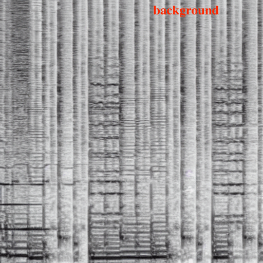
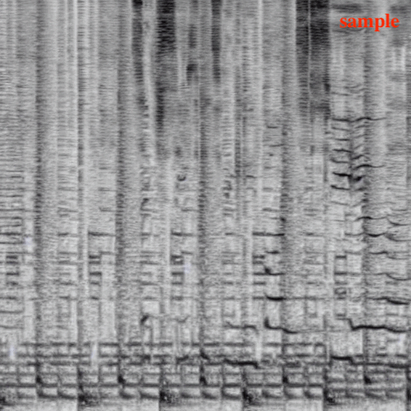
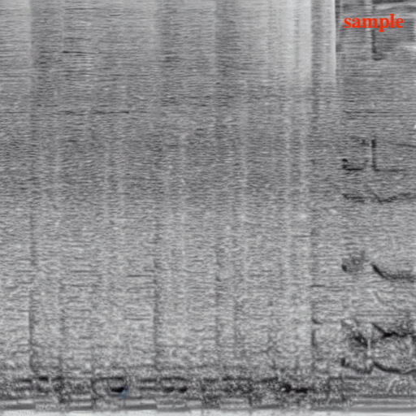
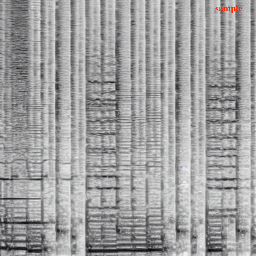
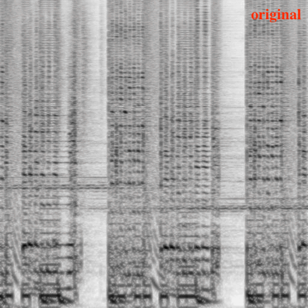

# Controlled Audio Inpainting using Riffusion and ImagePix2Pix

## Summary: 

This project suggests the feasibility of training an InstructPix2Pix model for the task of audio inpainting. Based on prior work by Brooks, et. al. on . [InstructPix2Pix: Learning to Follow Image Editing Instructions](https://arxiv.org/pdf/2211.09800.pdf). 

## Detailed Summary:

The audio inpainting task is as follows: given an input clip of musical audio and a textual editing prompt describing the desired feature added to a song, generate an output clip, which is the input audio clip with an audio representation of the edit prompt superimposed in. 

In this project, we instead look at a simpler task: given input audio, "paint in" a *vocal melody* as described by a text prompt. This can be generalized to any type of instrument / musical stem with proper training.

To complete this task, we trained an InstructPix2Pix model to learn to "edit in" a vocal part of a spectrogram, which is essentially an image-transformation representation of a 5 second clip of audio. We trained this task off the [Riffusion V1](https://huggingface.co/riffusion/riffusion-model-v1/tree/main) checkpoint, developed by Seth Forsgren Hayk Martiros, which is a fine-tune of Stable Diffusion V1.5 which has learned to recognize and diffuse in the spectrogram image space.

## Training Setup:

To train an InstructPix2Pix model, training data must be in the following form: (Original Image, Edit Instruction, Edited Image). For our task, this takes the form:

- **Original image**:  the spectrogram of the "background audio" or the song without vocals
- **Edit instruction**:  a text prompt in a form like "add a {style-descriptors} {instrument-stem}"
- **Edited image**:  the spectrogram of the "full audio", which includes the vocals in the training song

We developed training data using MUSDB-18, a dataset with pre-stemmed audio for a few hundred royalty-free songs with vocal melodies, making it easy to form these original-edit image pairs by selecting a stem to remove from the input audio example. 

To show how a training example is prepared, we start with a 5 second audio clip of the background audio stems for a song in MUSDB-18:

https://github.com/zachary-shah/riff-pix2pix/assets/123213526/6c06268f-8653-46e7-80b3-e887243db472


This is considered the "Original" audio. Then, we add the vocal audio stem from the example to act as the "Edited" audio, which is the target for the model to learn to generate such stems:

https://github.com/zachary-shah/riff-pix2pix/assets/123213526/83462328-9aa4-4750-a029-25a219c6b740

Since SD diffuses in the image space, we instead prepare an original/edited image pair from these pieces of audio, where the original contains the background and the edited target image contains the background + vocals, with the edit prompt for this particular example as: "add a female vocal pop melody, electronic style, with playful long held vocal notes":



With about 30,000 more examples like these, we completed training on an A10G GPU for 72 hours (300,000 global steps with batch size = 4) on the full MUSDB-18 dataset. Our training procedure is reproducible below.

## Results:

Overall, the approach works... sometimes. When it works, our model generates decently fitting vocal melodies. For example, here is one example of an input audio in our test set:

https://github.com/zachary-shah/riff-pix2pix/assets/123213526/6abb9539-2cd1-4a94-995d-0202ce0fd578

Converting this to a spectrogram and feeding it into the model with the prompt to "add a female vocal pop-rock melody with an etherial voice", the spectrogram sample visibly preserves the background audio structure whilst adding a melody on top:



Here is the converted audio of the sample:

https://github.com/zachary-shah/riff-pix2pix/assets/123213526/97edba3b-e7eb-4477-b8fb-9be39bbc5b68

And hear that the vocals generated are audibly different than the vocals of the original song we extracted the background audio from:

https://github.com/zachary-shah/riff-pix2pix/assets/123213526/3d5608b9-aa39-40f3-9637-46a95dcbe530

Here is a second example, instead for a heavy metal song, given the background audio and a prompt to "add a heavy metal scremo vocal part, borderline satanic vocals":



The vocals generated here are quite sparse, but the background audio is still preserved. Here is the sample:

https://github.com/zachary-shah/riff-pix2pix/assets/123213526/93a28da5-8c69-4050-b175-952222b2bdcc


Compare this to the original input background:

https://github.com/zachary-shah/riff-pix2pix/assets/123213526/3312881f-f334-41c8-b2cf-c7b8c6b6cbaa

Though this approach works sometimes, about 80% of the time, given a new input spectrogram and an edit instruction, the edit is not performed and the input. It is likely that the perturbation in the text is not strong enough to find a spectral representation of the audio, likely because the dimensionality of the edit instruction is pretty small in our proof of concept. Here is an example of the model input and its sample for cases when this happens, where you can see the sample just looks like a slightly noisy version of the original background input with no vocals generated:




Even with a search over different image and text guidance scales, which modify how much the model weights the instruction in the text versus the preservation of features in the input image (see the [InstructPix2Pix Paper](https://arxiv.org/pdf/2211.09800.pdf) for details of how this works), this issue prevails. It is likely due to the fact that the model somewhat over-fit to its training data. 

This is validated when conducting inference on a song example in the training dataset. Observe the original image, target image, and model sample below:



Here, we see the model's sampled vocal patterns in the spectrogram just look like an amplified version of the vocals in the target image, meaning its prediction of the vocal patterns was overfit to the vocals it observed during training. This was the case no matter what text prompt we provided, even with high textual guidance scales up to $s_T=20$.

For this example, you can hear that the model sample "echoes" some of the vocal features in the training target example, further supporting this conclusion:

Training Target (or label):

https://github.com/zachary-shah/riff-pix2pix/assets/123213526/d38053f3-cc9f-4217-a4e3-c91f53760fd9

Inference Sample (hear the echo of lyrics present in the label): 

https://github.com/zachary-shah/riff-pix2pix/assets/123213526/3068bead-6dfe-490e-b91f-9afd138cef76

## Conclusion

Though there were some issues in our implementation, if trained at a larger scale with a larger variety of "edit" instructions to the music, it is likely these overfitting issues would not remain. However, when we test this model on unseen audio, as shown in the two examples above, there is a visible edit made that matches the edit instruction provided, with high-quality preservation of the input. This initial project shows promise to use an InstructPix2Pix training architecture to build a diffusion model for the audio-inpainting task.

And that's our project! Of course, there are many more improvements to make, like generating more coherent lyrics (which is an open problem in the generative audio community) or extending the audio generation to longer than 5 seconds. However, our project demonstrates the potential for exploring deep spectral conditioning text-to-audio generation.

## How To Run Inference

Our pretrained model is located on HuggingFace [here](https://huggingface.co/zachary-shah/riff-pix2pix-v1). We also have a mini-test dataset in order to demonstrate inference. Set up your environment with the following:

```git install lfs```
```pip install -r requirements.txt```

Here is a script to demo inference on our pre-trained model using a mini test dataset we prepared (which generated the samples above):

```python inference_instruct_pix2pix.py --seed --max_samples 10 --num_inference_steps 100```

Modify this code to try inference on your own audio examples. This requires preparing them as spectrograms: see /Riffusion on how to do this. 

## How To Train

First, we preprocessed all of MUSDB-18 into input/edit spectrogram pairs, wich prompts labeled manually per song, using the following script:

```python preprocess_musdb.py --root_data_dir "/data/musdb18/train" --output_dir "/data/musdb18-pix2pix/train" --pitch_augment```

This split each song into 5-second segments to prepare multiple training examples per song. We also perturb the audio with pitch shifts to increase the cardinality of our dataset.

Then, the dataset must be uploaded to HuggingfaceHub in order to be accessed by Diffusers for setting up a training dataset: 

```python upload_musdb.py --data_root "/data/musdb18-pix2pix/train"```

Finally, training can be done by setting up an environment with **accelerate** from Diffusers, and below is the settings we used in order to train our model:

```bash
conda create --name diffusers python=3.8.5
conda activate diffusers
pip install -r requirements.txt
accelerate config
accelerate launch train_instruct_pix2pix.py \
--output_dir "/data/pix2pix-riff-ckpt" \
--resume_from_checkpoint "latest" \
--seed 0 \
--max_train_steps 300000 \
--resolution 512 \
--train_batch_size 4 \
--dataloader_num_workers 16 \
--checkpointing_steps 30000 \
--checkpoints_total_limit 3 \
--conditioning_dropout_prob=0.05 
```

To decrease memory usage, Diffusers also provides gradient checkpointing via the ```--gradient_checkpointing``` parameter option, and ```--enable_xformers_memory_efficient_attention``` for low xla memory consumption.
